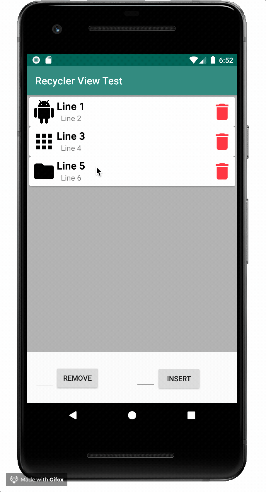

# Android Example Application

This is an example Android Application Implementing Basic RecyclerView Functions (Such as Insert & Delete At Specific Item)


## Previews




## Installation
Clone this repository and import into **Android Studio**
```
git clone https://github.com/rutaks/recyclerview-test.git
```

Open Project, Right Click on **app** and select **Synchronize App**.
Make Sure You have an internet connection.

## Build variants
Use the Android Studio *Build Variants* button to choose between **production** and **staging** flavors combined with debug and release build types


## Generating signed APK
From Android Studio:
1. ***Build*** menu
2. ***Generate Signed APK...***
3. Fill in the keystore information *(you only need to do this once manually and then let Android Studio remember it)*

## Maintainers
* [Rutakayile Samuel](http://github.com/rutaks)